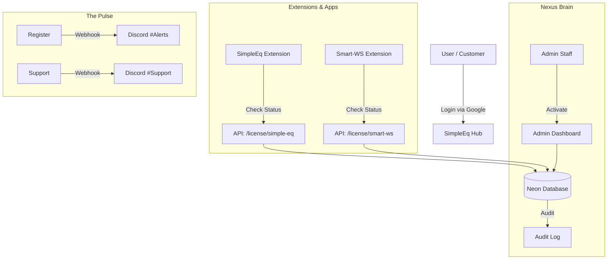

# Project Map — SimpleEq Hub (The Nexus)

## 1) Philosophy
**"One Identity, Many Licenses"**
SimpleEq Hub (หรือ Nexus Core) คือ Central Command Center ที่ดูแลเรื่อง Identity, Authorization และ Licensing สำหรับ Ecosystem ทั้งหมดของ SimpleEq และ Smart-WS
แนวคิดคือการแยก Business Logic (ใครจ่ายเงิน? ใครมีสิทธิ์?) ออกจาก Extension Logic เพื่อความปลอดภัยและความยืดหยุ่นในการ Scale สินค้าใหม่ ๆ

## 2) Key Landmarks
- `app/` — Next.js App Router (UI + API Routes)
- `app/admin/` — **The Cockpit**: ศูนย์ควบคุมสำหรับ Admin เพื่อ Activate Product, ดู Logs, และแก้ปัญหา User
- `prisma/schema.prisma` — **The Truth**: เก็บโครงสร้างข้อมูล User, Product, License
- `lib/discord.ts` — **The Pulse**: ระบบแจ้งเตือน Real-time เข้า Discord Hook
- `tests/` — **The Guard**: Test Suite (Vitest) ยืนยันความถูกต้องของ Logic

## 3) Architecture & Data Flow

## 🔌 Connected Clients (The Body)
ระบบนี้ถูกออกแบบมาให้รองรับ Client หลากหลาย:

1.  **SimpleEq Extension** (Legacy & Core)
    *   **Project**: [projects/SimpleEq](../SimpleEq)
    *   **Status**: ✅ Connected
    *   **Mechanism**: Session Cookie + API Check

2.  **Smart-WS Extension** (New Frontier)
    *   **Project**: [projects/Smart-WS](../Smart-WS)
    *   **Status**: 🚧 Planning / Integration Phase
    *   **Mechanism**: Will use the same Login Flow as SimpleEq

## 4) Current Territory
- ✅ **Infrastructure**: Next.js 14, Tailwind, Prisma, Neon DB
- ✅ **Auth Engine**: Better Auth Implemented (Google OAuth)
- ✅ **Admin V1**: Manual Approval for "SimpleEq Pro" (Legacy Schema)
- 🚧 **Nexus Evolution** (In Progress):
    - [ ] **Database Migration**: เปลี่ยนจาก `subscriptionStatus` เป็น `License` Table
    - [ ] **Multi-Product Support**: รองรับ `simple-eq`, `smart-ws` ในระบบเดียว
    - [ ] **Master Role**: เพิ่ม Super Admin Role
    - [ ] **Discord Webhooks**: แจ้งเตือนยอดขายและคนสมัครใหม่

## 5) Test Suite
- **Runner**: Vitest (Unit & Integration Tests)
- **Key Tests**:
    - `auth.test.ts`: Login Flow & Session
    - `admin.test.ts`: Role Guard & Approval Logic
    - `api.test.ts`: Endpoint Response Structure

## 6) Roles & Permissions Matrix
| Role | Capabilities |
| :--- | :--- |
| **USER** | Login, View Own Licenses, Request Support |
| **ADMIN** | View All Users, Activate/Revoke Licenses (Standard), View Audit Logs |
| **MASTER** | **Delete User**, Manage Products, Revoke Critical Actions |

## 7) Challenges & Risks
- **Identity Complexity**: การเปลี่ยนจาก Simple Status เป็น License Table อาจทำให้ logic การเช็คสิทธิ์ซับซ้อนขึ้น ต้อง Test Case ให้แน่น
- **Backward Compatibility**: ต้องมั่นใจว่า Extension ตัวเก่า (SimpleEq V1) ยังทำงานได้ระหว่างที่ Migration
- **Admin Audit**: การ Activate ให้ลูกค้าแบบ Manual ต้องมี Log ที่ละเอียดมาก ๆ ป้องกันการทุจริตหรือความผิดพลาด

## 8) Strategy & Roadmap
1.  **Phase 1 (Foundation)**: ปรับ Database Schema ให้รองรับ N Products
2.  **Phase 2 (Cockpit)**: อัปเดตหน้า Admin ให้เลือกติ๊ก Product ได้รายตัว
3.  **Phase 3 (Pulse)**: เชื่อมต่อ Discord Webhooks เพื่อการ Monitor แบบ Real-time
4.  **Phase 4 (Bridge)**: เชื่อมต่อ Smart-WS เข้ากับระบบ License ใหม่

---
*Last Updated: 2026-02-28 via Oracle Keeper*
